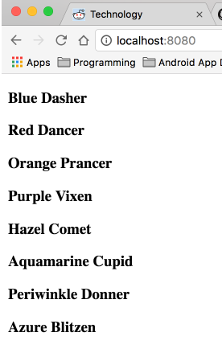

#Reindeer


## Description
In this exercise I will combine data from to arrays into a single sentenance.

## How to run
In your terminal run:
```
http-server -p 9999
```
then navigate to http://localhost:9999 in your browser.

## Screenshots
##Array That are being combined
```
var colors = ["Blue", "Red", "Orange", "Purple", "Hazel", "Aquamarine", "Periwinkle", "Azure", "Fuchsia", "Chocolate", "Amber", "Amaranth"];
var reindeer = ["Dasher", "Dancer", "Prancer", "Vixen", "Comet", "Cupid", "Donner", "Blitzen"];

```

##On Page Load



## Contributors
- [Justin Leggett](https://github.com/justinal64)